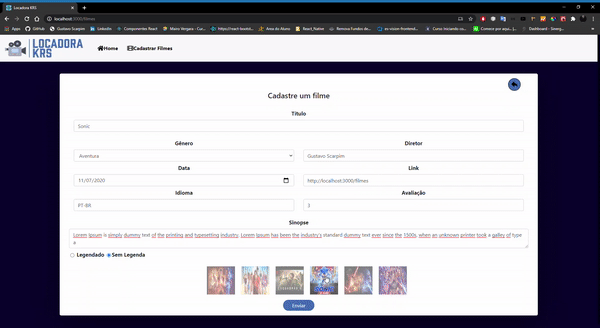

# Desafio Front-End Developer

Esse projeto foi desenvolvido através de um desafio proposto pelo grupo KRS.

O desafio é desenvolver uma locadora de filmes onde seja possível Cadastrar, Visualizar, Atualizar e deletar os filmes (CRUD)

Foi pedido os seguintes campos: 

* Título do Filme - Obrigatório
* Sinopse - Obrigatório
* Gênero - Obrigatório
* Data de lançamento (mostrar apenas o ano na tela de consulta) - Não obrigatório
* Idioma - Obrigatório
* Legendado - Obrigatório
* Diretor - Não obrigatório
* Link no IMDB - Não obrigatório
* Avaliação do filme - Não obrigatório

# Resolução do desafio

## API - NodeJs && MongoDB

Para resolver esse desafio eu criei uma API em NodeJS com mongoDB para cadastrar os filmes no banco de dados.

<b>Criei os seguintes campos em um Schema da minha API Rest: </b>

* Título - titulo do filme não permitindo o filme ter o mesmo titulo,
* Sinopse - sinopse do filme não permitindo o filme ter a mesma sinopse,
* Genero - genero do filme,
* Data - data de lançamento,
* Idioma - Idioma do filme,
* Legendado - true ou false para saber se ele é legendado ou não,
* Diretor - nome do diretor,
* Link - nota do filme,
* Avaliacao - código para adicionar uma imagem do filme,

## Front End - React Hooks && Styled-Components

Além de criar uma API eu desenvolvi todo o FrontEnd do projeto em ReactJs com Styled-Components, 
fiz o consumo da minha API para Cadastrar, Editar, Excluir e Visualizar os meus filmes e para carregar eles dinamicamente.

## Iniciar Projeto

<b>1º Clone esse repositório no seu computador ou baixe no formato (ZIP).</b>

<b>2º Abra o projeto em seu editor favorito, vá para a pasta server dentro de API e coloque o caminho de conexão com o seu MONGODB na váriavel 'const mongoURI', por fim, abra o seu prompt de comando dentro da pasta API e rode o seguinte comando 'npm install ou yarn install' para poder baixar todas as depêndencias do projeto, em seguida rode o comando 'npm run dev' para inicializar a API.</b>

<b>3º Abra outro prompt de comando dentro da pasta 'web' e rode o seguinte comando 'npm install ou yarn install' para poder baixar todas as depêndencias do projeto em React.</b>

<b>4º Rode o comando 'npm start' para inicializar o projeto.</b>

## Testes

Foram realizados diversos testes para verificação de erros, como, verificar a quantidade máxima de caracteres que caberia no layout, verificação de duplicidades de filmes com o mesmo titulo e sinopse, responsividade para mobile e computadores maiores e menores, experiência de úsuario com UI e UX.

## Banco de Dados

<b>Caso seja necessário, deixei um arquivo na raiz da minha API chamado "export_dados_mongoDB.json" monstrando um JSON para cadastrar alguns dados no mongoDB</b>

# Desenvolvido por Gustavo Scarpim:

